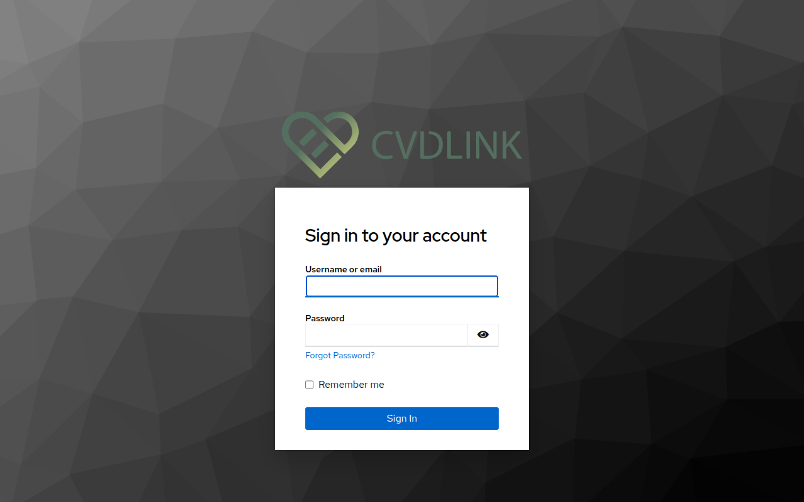
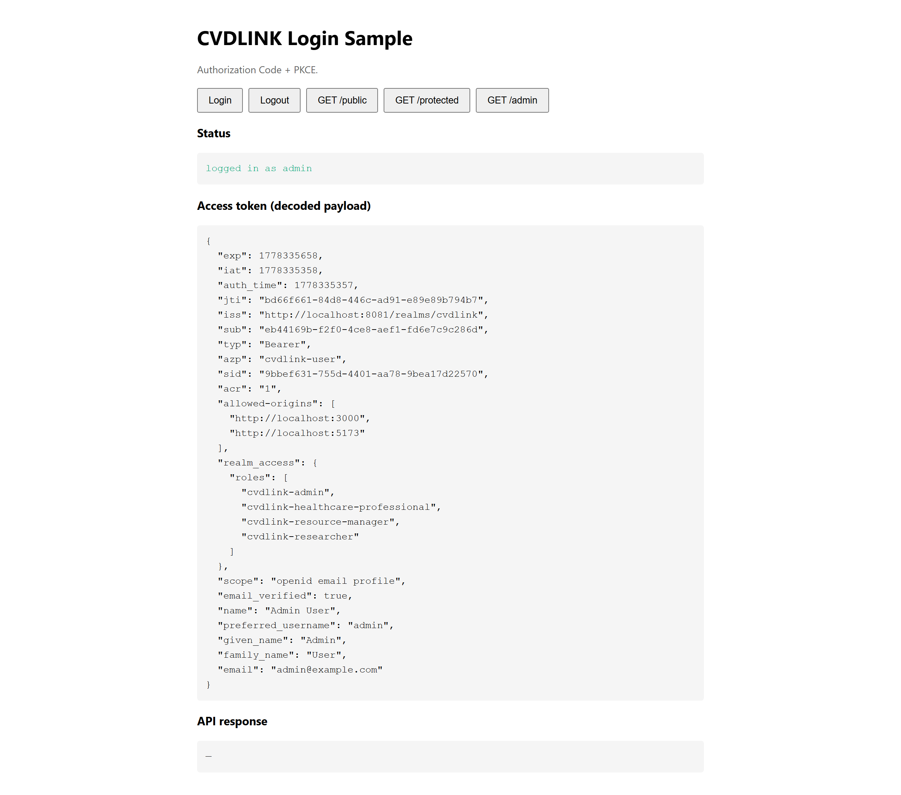
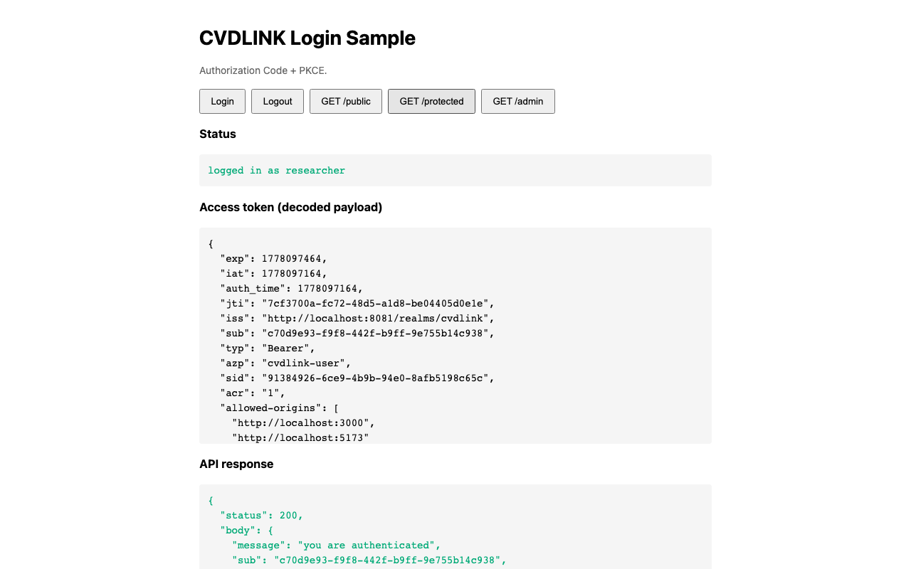
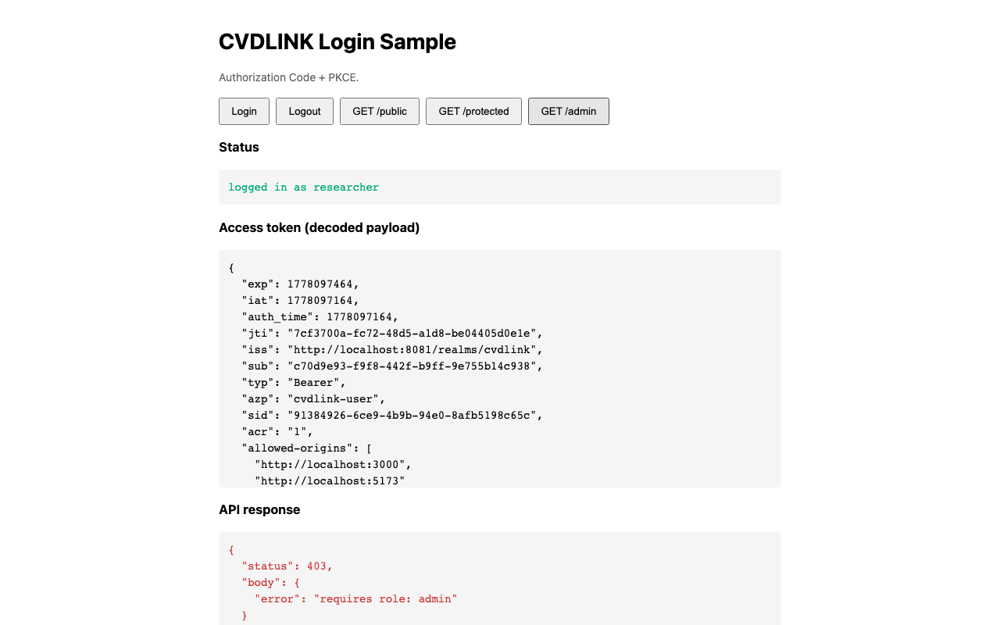
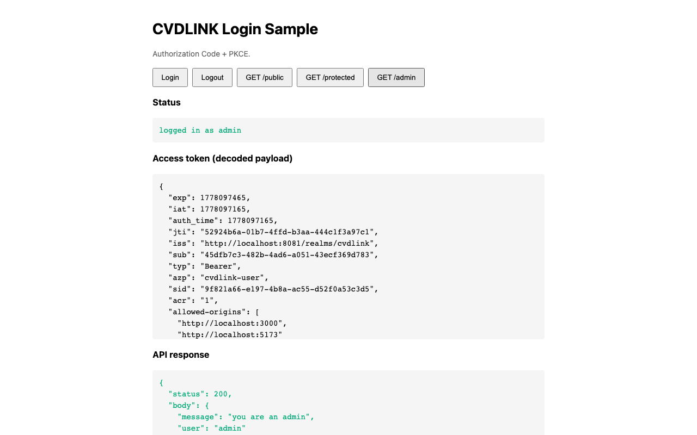

# keyclock_playground

A self-contained Keycloak playground: spin up Keycloak with one command, then walk through OIDC + JWT auth end-to-end with working browser and API examples.

## Table of contents

- [Abbreviations](#abbreviations)
- [Content](#content)
- [Quickstart](#quickstart)
- [Screenshots](#screenshots)
- [Repo layout](#repo-layout)
- [Auth flows covered](#auth-flows-covered)
- [Default credentials](#default-credentials)
- [Custom login theme (CVDLINK)](#custom-login-theme-cvdlink)
- [LDAP federation (optional)](#ldap-federation-optional)
- [Documentation](#documentation)
- [Acknowledgement](#acknowledgement)
- [License](#license)

## Abbreviations

Terms used across this README. Each linked doc carries a more focused
abbreviation table; [`docs/04-ldap.md` §4.1](docs/04-ldap.md#41-abbreviations)
has the full glossary.

| Short  | Long                              | Used in this file for |
|--------|-----------------------------------|------------------------|
| OIDC   | OpenID Connect                    | The auth protocol Keycloak speaks. |
| JWT    | JSON Web Token                    | The signed bearer token Keycloak issues. |
| JWKS   | JSON Web Key Set                  | The endpoint that publishes JWT signing keys. |
| PKCE   | Proof Key for Code Exchange       | OAuth extension required for public clients. |
| BFF    | Backend-for-Frontend              | Server-side companion that keeps tokens out of JavaScript. |
| LDAP   | Lightweight Directory Access Protocol | Wire protocol for OpenLDAP. |
| SSO    | Single Sign-On                    | One Keycloak session, many apps. |
| IdP    | Identity Provider                 | Keycloak itself. |
| SPA    | Single-Page Application           | Browser app, e.g. the CVDLINK Login Sample. |
| FTL    | FreeMarker Template Language      | Keycloak's login-theme template language. |
| CSS    | Cascading Style Sheets            | Used by the custom login theme. |
| DOM    | Document Object Model             | Referenced in the theme description. |

## Content

- **Keycloak 26 + Postgres** via `docker-compose`
- **Auto-imported realm** ([`realm-export.json`](realm-export.json)) with clients, roles, and demo users
- **Custom login theme** ([`themes/cvdlink/`](themes/cvdlink/login/)) replacing the realm-name banner with the CVDLINK logo
- **Two runnable examples** that talk to it:
  - [`examples/cvdlink-login-sample`](examples/cvdlink-login-sample/) — Authorization Code + PKCE flow, served by FastAPI
  - [`examples/python-api`](examples/python-api/) — FastAPI resource server validating JWTs via JWKS
- **Step-by-step docs** with Mermaid sequence diagrams and captured screenshots

## Quickstart

```bash
# 1. start Keycloak + Postgres (first start auto-imports the realm)
docker compose up -d

# 2. wait ~30s, then open the admin console
#    http://localhost:8081/admin   (admin / admin)

# 3. run the API
cd examples/python-api
python3 -m venv .venv && source .venv/bin/activate
pip install -r requirements.txt && cp .env.example .env
uvicorn server:app --port 3001
#    listening on :3001

# 4. in another terminal, serve the CVDLINK Login Sample
cd examples/cvdlink-login-sample
python3 -m venv .venv && source .venv/bin/activate
pip install -r requirements.txt
uvicorn server:app --port 5173
#    open http://localhost:5173 → click Login → researcher / researcher123
```

> ℹ️ If you change `realm-export.json` after the first boot, run `docker compose down -v` (drop the postgres volume) before `up -d` again — `--import-realm` skips realms that already exist.

> ℹ️ Want an OpenLDAP federation demo on the side? See [LDAP federation (optional)](#ldap-federation-optional).

## Screenshots

The Authorization Code + PKCE flow, captured against this stack. The full walkthrough lives in [`docs/03-oidc-flow.md` §3.2](docs/03-oidc-flow.md#32-authorization-code--pkce).

| Step | Screenshot |
|------|------------|
| Keycloak login page (CVDLINK theme) |  |
| Sample app after login: decoded access token |  |
| `GET /protected` as `researcher` → 200 |  |
| `GET /admin` as `researcher` (no `cvdlink-admin` role) → 403 |  |
| `GET /admin` as `admin` (holds all four CVDLINK roles) → 200 |  |

## Repo layout

```
.
├── docker-compose.yml               # Keycloak 26 + Postgres
├── realm-export.json                # auto-imported on first boot (users, roles, clients, loginTheme)
├── resource/                        # source assets (cvdlink_logo.png)
├── themes/
│   └── cvdlink/login/               # custom Keycloak login theme (mounted into the container)
├── docs/
│   ├── 01-installation.md           # bring up the stack, first admin login
│   ├── 02-realm-setup.md            # manual click-by-click realm config
│   ├── 03-oidc-flow.md              # Auth Code+PKCE, Client Credentials, JWT internals
│   ├── 04-ldap.md                   # LDAP federation (optional)
│   └── images/                      # screenshots referenced from the docs
├── examples/
│   ├── cvdlink-login-sample/        # PKCE login flow, FastAPI static server
│   └── python-api/                  # FastAPI + PyJWT JWT validation
└── ldap/                            # OpenLDAP + seed container (opt-in profile)
```

## Auth flows covered

| Flow                       | Used by                  | Doc                                                                                            |
|----------------------------|--------------------------|------------------------------------------------------------------------------------------------|
| Authorization Code + PKCE  | browser, mobile, native  | [`docs/03-oidc-flow.md` §3.2](docs/03-oidc-flow.md#32-authorization-code--pkce)                |
| Client Credentials         | service-to-service       | [`docs/03-oidc-flow.md` §3.3](docs/03-oidc-flow.md#33-client-credentials)                      |
| Refresh Token              | extending sessions       | [`docs/03-oidc-flow.md` §3.5](docs/03-oidc-flow.md#35-refresh-tokens)                          |
| Logout (`end_session`)     | sign-out                 | [`docs/03-oidc-flow.md` §3.6](docs/03-oidc-flow.md#36-logout)                                  |

## Default credentials

| Who                  | Username     | Password                       | Realm roles                                                                                     |
|----------------------|--------------|--------------------------------|-------------------------------------------------------------------------------------------------|
| Keycloak admin       | `admin`      | `admin`                        | (master realm)                                                                                  |
| Researcher user      | `researcher` | `researcher123`                | `cvdlink-researcher`                                                                            |
| Admin user           | `admin`      | `admin123`                     | `cvdlink-healthcare-professional`, `cvdlink-researcher`, `cvdlink-resource-manager`, `cvdlink-admin` |
| `python-api` secret  | —            | `python-api-secret-change-me`  | service account                                                                                 |

The four CVDLINK realm roles are:

| Slug                              | Description                                |
|-----------------------------------|--------------------------------------------|
| `cvdlink-healthcare-professional` | CVDLINK Healthcare Professional            |
| `cvdlink-researcher`              | CVDLINK Researcher                         |
| `cvdlink-resource-manager`        | CVDLINK Resource Manager (Systemic Role)   |
| `cvdlink-admin`                   | CVDLINK Admin                              |

> ℹ️ The `admin`/`admin` row is the **master-realm** Keycloak superuser (admin console login). The `admin`/`admin123` row is a **cvdlink-realm** user — different namespace, no conflict.

> ⚠️ Defaults are for local play only. Do not deploy this stack as-is.

## Custom login theme (CVDLINK)

Out of the box, Keycloak 26's default `keycloak.v2` login theme renders the realm's `displayName` as a text banner inside a Patternfly v5 two-column layout (form on the left, brand on the right at desktop widths). For this playground we replace that banner with the CVDLINK logo and stack the layout vertically.

### What was changed and why

| Layer                        | Change                                                                                                       | Why                                                                                                                |
|------------------------------|--------------------------------------------------------------------------------------------------------------|--------------------------------------------------------------------------------------------------------------------|
| Theme directory              | New `themes/cvdlink/login/` extending `keycloak.v2`                                                           | Inherits all of Keycloak's templates and FTL logic; only the visuals are overridden.                               |
| `theme.properties`           | `parent=keycloak.v2`, `import=common/keycloak`, `styles=css/login.css css/custom.css`                         | Keycloak's `styles` setting is replaced (not merged) by a child theme — relisting `css/login.css` keeps the parent CSS, and `custom.css` is appended last so its rules win on equal specificity. |
| `resources/css/custom.css`   | Force `.pf-v5-c-login__container` from grid to flex-column with `max-width: 600px; margin: 0 auto`            | Stacks the brand above the form and centers everything; `!important` is used because Patternfly's grid template comes from a CSS variable that has equal specificity. |
|                              | On `#kc-header-wrapper`: `background-image` to the logo, `background-size: contain`, `text-indent: -9999px`   | Hides the realm display-name text without removing it from the DOM (so screen readers still read the realm name) while drawing the logo in its place. |
| `resources/img/cvdlink_logo.png` | Copy of [`resource/cvdlink_logo.png`](resource/cvdlink_logo.png) served by Keycloak's static-resource handler | Keycloak exposes theme resources at `/resources/<version>/login/cvdlink/img/...`, which is what the CSS `url('../img/...')` resolves to.   |
| `docker-compose.yml`         | Add `./themes/cvdlink:/opt/keycloak/themes/cvdlink:ro` to the keycloak service                                | Mounts only this theme — mounting the whole `./themes/` would shadow Keycloak's built-in `base`, `keycloak`, and `keycloak.v2`, breaking other themes. |
| `realm-export.json`          | `"loginTheme": "cvdlink"` on the realm                                                                        | Activates the custom theme at the realm level. Without this, Keycloak falls back to `keycloak.v2`. |

### File map

- [`themes/cvdlink/login/theme.properties`](themes/cvdlink/login/theme.properties)
- [`themes/cvdlink/login/resources/css/custom.css`](themes/cvdlink/login/resources/css/custom.css)
- [`themes/cvdlink/login/resources/img/cvdlink_logo.png`](themes/cvdlink/login/resources/img/cvdlink_logo.png)
- [`docker-compose.yml`](docker-compose.yml) → `services.keycloak.volumes`
- [`realm-export.json`](realm-export.json) → `realm.loginTheme`

### Iterating on the design

1. Edit `themes/cvdlink/login/resources/css/custom.css` (or drop a new logo into `resources/img/`).
2. Restart the keycloak container — the volume is read-only and Keycloak picks up theme changes on restart:
   ```bash
   docker compose restart keycloak
   ```
3. Hard-refresh the login page (theme assets are versioned, so a normal reload usually works).
4. If you change which theme a realm uses (`loginTheme`) **after** the realm has been imported, you must drop the postgres volume so the realm is re-imported: `docker compose down -v && docker compose up -d`.

## LDAP federation (optional)

An **OpenLDAP** server federated into a separate `ldap` realm in Keycloak —
demonstrates Keycloak's *external user store* pattern. The default
`docker compose up -d` flow is unchanged; LDAP is opt-in via a Docker Compose
profile.

```bash
# bring up the LDAP profile (openldap + a one-shot seed container)
docker compose --profile ldap up -d --build

# run the integration test suite
docker compose --profile ldap run --rm ldap-seed pytest -v

# tear down only LDAP
docker compose --profile ldap down
```

The seed container creates the `ldap` realm, registers OpenLDAP as a Keycloak
`UserStorageProvider`, and writes users + groups from
[`ldap/users.yaml`](ldap/users.yaml):

| Username | LDAP groups                                | CVDLINK role equivalent                                    |
|----------|--------------------------------------------|-------------------------------------------------------------|
| `rytis`  | `admins`, `researchers`                    | Admin + Researcher                                          |
| `katie`  | `researchers`                              | Researcher                                                  |
| `michael`  | `healthcare-professionals`                 | Healthcare Professional                                     |
| `marek`  | `resource-managers`                        | Resource Manager                                            |
| `sienna` | `healthcare-professionals`, `researchers`  | Healthcare Professional + Researcher (multi-group demo)     |

All five users share the password `changeme`. The full walkthrough — directory
tree, login sequence diagram, glossary of LDAP terms (DN, RDN, OU, CN, …), and
screenshots — lives in [`docs/04-ldap.md`](docs/04-ldap.md).

## Documentation

1. [`docs/01-installation.md`](docs/01-installation.md) — Docker, first admin login, OIDC discovery doc
2. [`docs/02-realm-setup.md`](docs/02-realm-setup.md) — manual realm/client/user setup (skip if you used the import)
3. [`docs/03-oidc-flow.md`](docs/03-oidc-flow.md) — auth flows + JWT structure
4. [`examples/python-api/README.md`](examples/python-api/README.md) — resource server walkthrough
5. [`examples/cvdlink-login-sample/README.md`](examples/cvdlink-login-sample/README.md) — CVDLINK Login Sample walkthrough
6. [`docs/04-ldap.md`](docs/04-ldap.md) — LDAP federation (optional)

## Acknowledgement

This research was supported by the [CVDLINK](https://cvdlink-project.eu/) project (EU Horizon grant agreement N°101137278)

[](https://raw.githubusercontent.com/rytisss/immutable-logging/main/res/CVDLINK_logo-v.png)

## License

MIT (see [`LICENSE`](LICENSE)).
