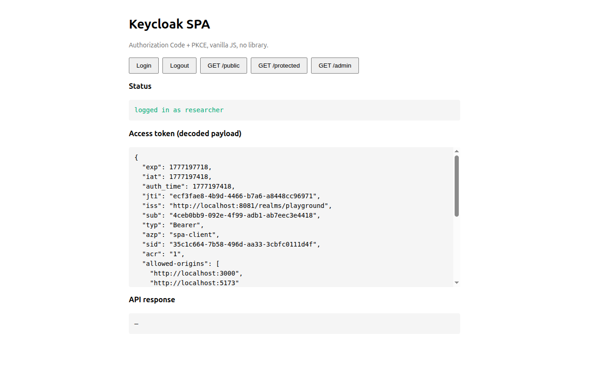
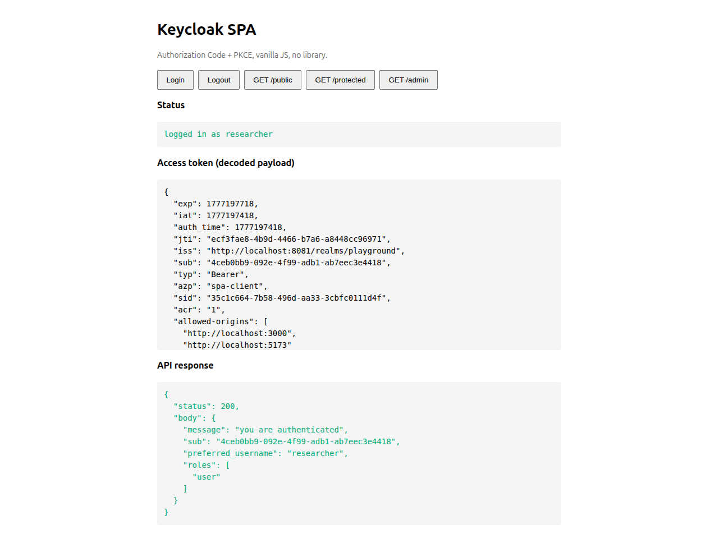
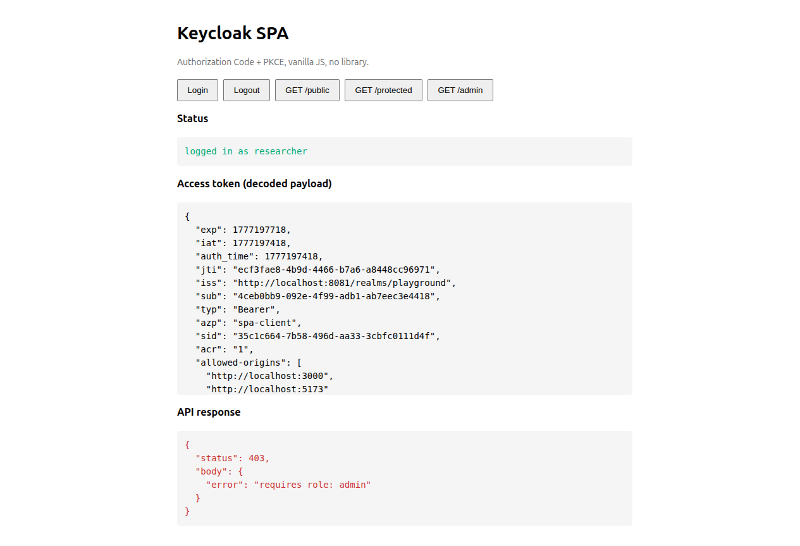
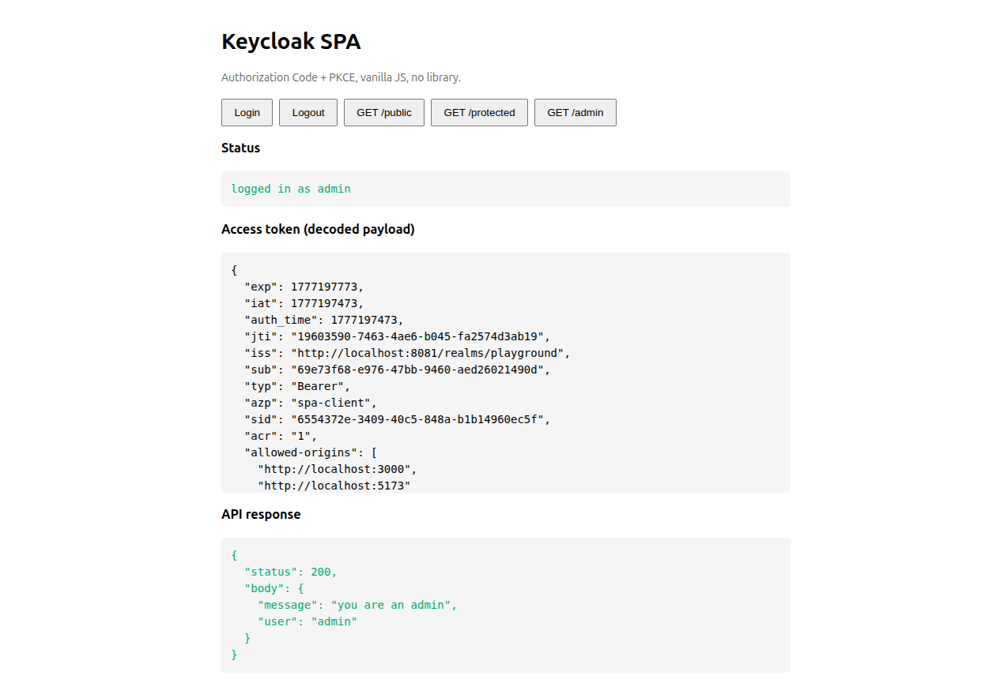

# keyclock_playground

A self-contained Keycloak playground: spin up Keycloak with one command, then walk through OIDC + JWT auth end-to-end with working SPA and API examples.

## What's inside

- **Keycloak 26 + Postgres** via `docker-compose`
- **Auto-imported realm** ([`realm-export.json`](realm-export.json)) with clients, roles, and demo users
- **Custom login theme** ([`themes/cvdlink/`](themes/cvdlink/login/)) replacing the realm-name banner with the cvdlink logo
- **Two runnable examples** that talk to it:
  - [`examples/spa`](examples/spa/) — vanilla JS Authorization Code + PKCE flow
  - [`examples/node-api`](examples/node-api/) — Express resource server validating JWTs via JWKS
- **Step-by-step docs** with Mermaid sequence diagrams and captured screenshots

## Quickstart

```bash
# 1. start Keycloak + Postgres (first start auto-imports the realm)
docker compose up -d

# 2. wait ~30s, then open the admin console
#    http://localhost:8081/admin   (admin / admin)

# 3. run the API
cd examples/node-api && cp .env.example .env && npm install && npm start
#    listening on :3001

# 4. in another terminal, serve the SPA
cd examples/spa && python3 -m http.server 5173
#    open http://localhost:5173 → click Login → researcher / researcher123
```

> ℹ️ If you change `realm-export.json` after the first boot, run `docker compose down -v` (drop the postgres volume) before `up -d` again — `--import-realm` skips realms that already exist.

## Screenshots

The Authorization Code + PKCE flow, captured against this stack. The full walkthrough lives in [`docs/03-oidc-flow.md` §3.1](docs/03-oidc-flow.md#31-authorization-code--pkce).

| Step | Screenshot |
|------|------------|
| Keycloak login page (cvdlink theme) |  |
| SPA after login: decoded access token |  |
| `GET /protected` as `researcher` → 200 |  |
| `GET /admin` as `researcher` → 403 |  |
| `GET /admin` as `admin` → 200 |  |

## Repo layout

```
.
├── docker-compose.yml       # Keycloak 26 + Postgres
├── realm-export.json        # auto-imported on first boot (users, roles, clients, loginTheme)
├── resource/                # source assets (cvdlink_logo.png)
├── themes/
│   └── cvdlink/login/       # custom Keycloak login theme (mounted into the container)
├── docs/
│   ├── 01-installation.md   # bring up the stack, first admin login
│   ├── 02-realm-setup.md    # manual click-by-click realm config
│   ├── 03-oidc-flow.md      # Auth Code+PKCE, Client Credentials, JWT internals
│   └── images/              # screenshots referenced from the docs
└── examples/
    ├── spa/                 # vanilla JS SPA (PKCE)
    └── node-api/            # Express + jose JWT validation
```

## Auth flows covered

| Flow                       | Used by                  | Doc                                                                                            |
|----------------------------|--------------------------|------------------------------------------------------------------------------------------------|
| Authorization Code + PKCE  | SPA, mobile, native      | [`docs/03-oidc-flow.md` §3.1](docs/03-oidc-flow.md#31-authorization-code--pkce)                |
| Client Credentials         | service-to-service       | [`docs/03-oidc-flow.md` §3.2](docs/03-oidc-flow.md#32-client-credentials)                      |
| Refresh Token              | extending sessions       | [`docs/03-oidc-flow.md` §3.4](docs/03-oidc-flow.md#34-refresh-tokens)                          |
| Logout (`end_session`)     | sign-out                 | [`docs/03-oidc-flow.md` §3.5](docs/03-oidc-flow.md#35-logout)                                  |

## Default credentials

| Who                | Username     | Password                     | Roles            |
|--------------------|--------------|------------------------------|------------------|
| Keycloak admin     | `admin`      | `admin`                      | (master realm)   |
| Researcher user    | `researcher` | `researcher123`              | `user`           |
| Admin user         | `admin`      | `admin123`                   | `user`, `admin`  |
| `node-api` secret  | —            | `node-api-secret-change-me`  | service account  |

> ℹ️ The `admin`/`admin` row is the **master-realm** Keycloak superuser (admin console login). The `admin`/`admin123` row is a **playground-realm** user — different namespace, no conflict.

> ⚠️ Defaults are for local play only. Do not deploy this stack as-is.

## Custom login theme (cvdlink)

The login page swaps the realm display name (default Keycloak shows the realm's `displayName` as a text banner) for the cvdlink logo. The change is contained in three places:

1. **[`themes/cvdlink/login/`](themes/cvdlink/login/)** — a custom login theme:
   - [`theme.properties`](themes/cvdlink/login/theme.properties) — extends `keycloak.v2`, declares `styles=css/login.css css/custom.css` so both the parent's stylesheet and our override are loaded.
   - [`resources/css/custom.css`](themes/cvdlink/login/resources/css/custom.css) — converts Patternfly v5's two-column login layout into a centered single column, then replaces the `#kc-header-wrapper` text with the logo via `background-image` + `text-indent: -9999px`.
   - [`resources/img/cvdlink_logo.png`](themes/cvdlink/login/resources/img/cvdlink_logo.png) — copy of [`resource/cvdlink_logo.png`](resource/cvdlink_logo.png), served by Keycloak under `/resources/<version>/login/cvdlink/img/`.
2. **[`docker-compose.yml`](docker-compose.yml)** — the keycloak service mounts only the theme dir (not the whole `themes/`, which would shadow Keycloak's built-in themes):
   ```yaml
   volumes:
     - ./themes/cvdlink:/opt/keycloak/themes/cvdlink:ro
   ```
3. **[`realm-export.json`](realm-export.json)** — the realm activates the theme:
   ```json
   "loginTheme": "cvdlink"
   ```

To customize further, drop a new logo into `themes/cvdlink/login/resources/img/cvdlink_logo.png` and tweak `custom.css`. Theme files are mounted read-only and Keycloak picks them up on container restart.

## Documentation order

1. [`docs/01-installation.md`](docs/01-installation.md) — Docker, first admin login, OIDC discovery doc
2. [`docs/02-realm-setup.md`](docs/02-realm-setup.md) — manual realm/client/user setup (skip if you used the import)
3. [`docs/03-oidc-flow.md`](docs/03-oidc-flow.md) — auth flows + JWT structure
4. [`examples/node-api/README.md`](examples/node-api/README.md) — resource server walkthrough
5. [`examples/spa/README.md`](examples/spa/README.md) — SPA walkthrough

## License

MIT (see [`LICENSE`](LICENSE)).
