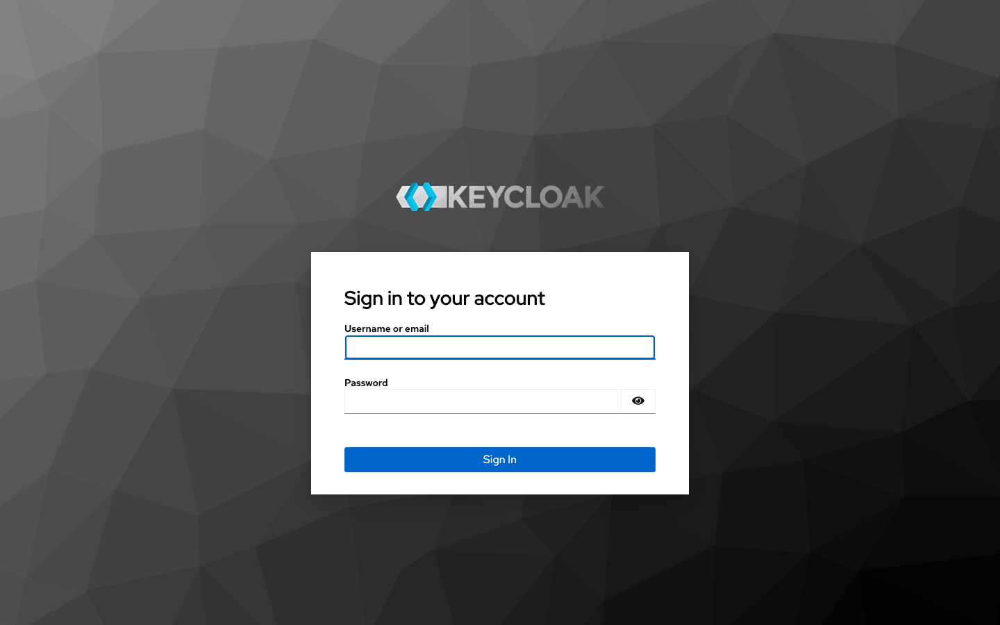
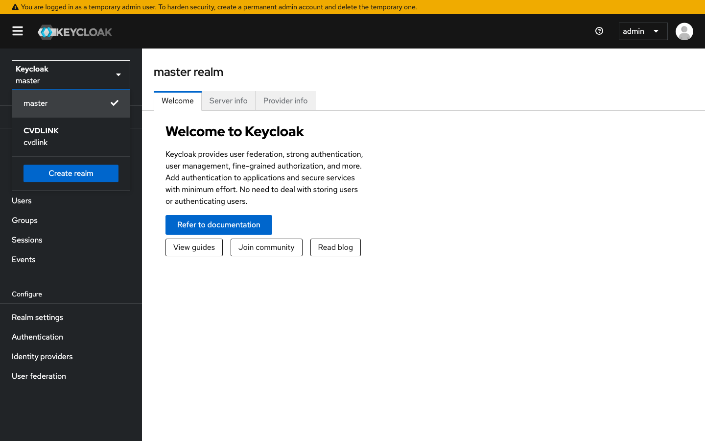
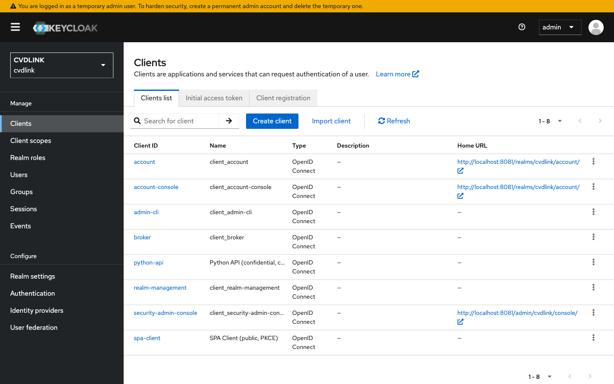
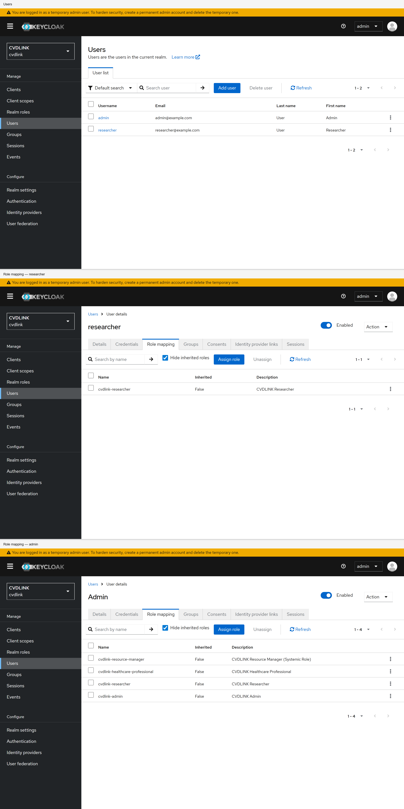

# 1. Installation

This guide spins up Keycloak 26 with Postgres using Docker Compose, then signs you into the admin console for the first time.

> **Time:** ~5 minutes
> **Prereqs:** Docker + Docker Compose v2

---

## 1.1 Abbreviations

Terms that appear in this guide. The full glossary is in
[`04-ldap.md` §4.1](04-ldap.md#41-abbreviations).

| Short | Long                        | Used here for |
|-------|-----------------------------|----------------|
| OIDC  | OpenID Connect              | The discovery document at `/.well-known/openid-configuration`. |
| JWT   | JSON Web Token              | Tokens issued by Keycloak. |
| JWKS  | JSON Web Key Set            | Public keys at `jwks_uri`. |
| PKCE  | Proof Key for Code Exchange | The flow used by the `cvdlink-user` client. |
| TLS   | Transport Layer Security    | What `start-dev` does *not* enable. |
| URI   | Uniform Resource Identifier | The endpoint columns. |

---

## 1.2 Start the stack

From the repo root:

```bash
docker compose up -d
```

This starts two containers:

| Service    | Image                              | Host port → container |
|------------|------------------------------------|------------------------|
| `postgres` | `postgres:16-alpine`               | (internal only)        |
| `keycloak` | `quay.io/keycloak/keycloak:26.0`   | **8081 → 8080**        |

> Keycloak listens on `8080` inside the container, but is exposed on **`8081`** on your host (port `8080` is commonly used by Traefik/Tomcat/etc.). Change the host port in `docker-compose.yml` if `8081` is also taken.

The `realm-export.json` is mounted into the Keycloak container and **auto-imported on first boot** (`--import-realm`). You don't need to click through the realm setup unless you want to (see `02-realm-setup.md` for the manual flow).

Wait ~30s for Keycloak to be ready. Tail logs to confirm:

```bash
docker compose logs -f keycloak
```

You're ready when you see something like:

```
Listening on: http://0.0.0.0:8080
Running the server in development mode.
```

> ⚠️ **Dev mode only.** `start-dev` disables HTTPS and is **not** suitable for production. For prod, use `start` with `KC_HOSTNAME` properly configured behind TLS.

---

## 1.3 Open the admin console

Navigate to: **http://localhost:8081/admin**

Log in with the bootstrap admin credentials:

| Field    | Value   |
|----------|---------|
| Username | `admin` |
| Password | `admin` |



After login you land on the **master** realm. Switch to the imported `cvdlink` realm via the realm dropdown in the top-left.



---

## 1.4 Verify the imported realm

In the `cvdlink` realm, confirm the following resources exist:

- **Clients** → `cvdlink-user` (public, PKCE) and `python-api` (confidential, service account)
- **Realm roles** → `user`, `admin`
- **Users** → `researcher` (role: user) and `admin` (roles: user + admin)





---

## 1.5 Grab the OIDC discovery document

Every Keycloak realm exposes its OIDC config at:

```
http://localhost:8081/realms/cvdlink/.well-known/openid-configuration
```

```bash
curl -s http://localhost:8081/realms/cvdlink/.well-known/openid-configuration | jq .
```

Key endpoints to note (used by the examples):

| Endpoint              | URL                                                                                |
|-----------------------|------------------------------------------------------------------------------------|
| `authorization`       | `http://localhost:8081/realms/cvdlink/protocol/openid-connect/auth`                |
| `token`               | `http://localhost:8081/realms/cvdlink/protocol/openid-connect/token`               |
| `userinfo`            | `http://localhost:8081/realms/cvdlink/protocol/openid-connect/userinfo`            |
| `jwks_uri`            | `http://localhost:8081/realms/cvdlink/protocol/openid-connect/certs`               |
| `end_session_endpoint`| `http://localhost:8081/realms/cvdlink/protocol/openid-connect/logout`              |
| `issuer`              | `http://localhost:8081/realms/cvdlink`                                             |

---

## 1.6 Stop / reset

```bash
# stop, keep data
docker compose down

# stop and wipe (re-imports realm on next start)
docker compose down -v
```

---

**Next:** [`02-realm-setup.md`](02-realm-setup.md) — manual realm setup (click-by-click), or skip to [`03-oidc-flow.md`](03-oidc-flow.md) for the auth flows.
