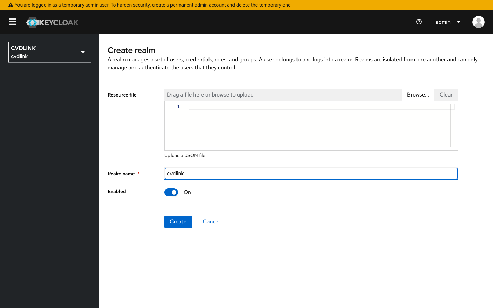
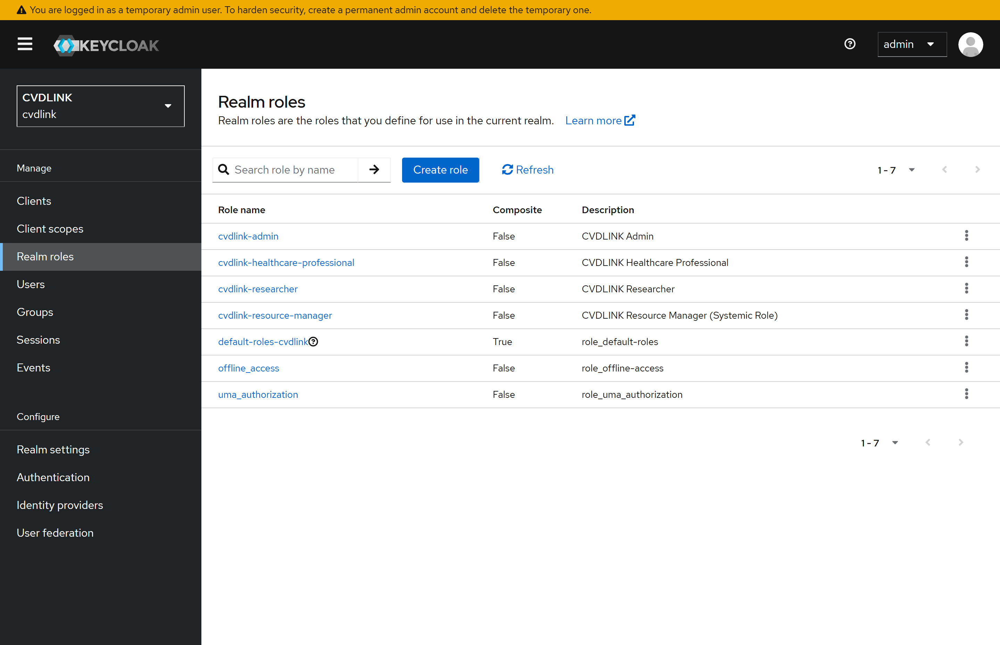
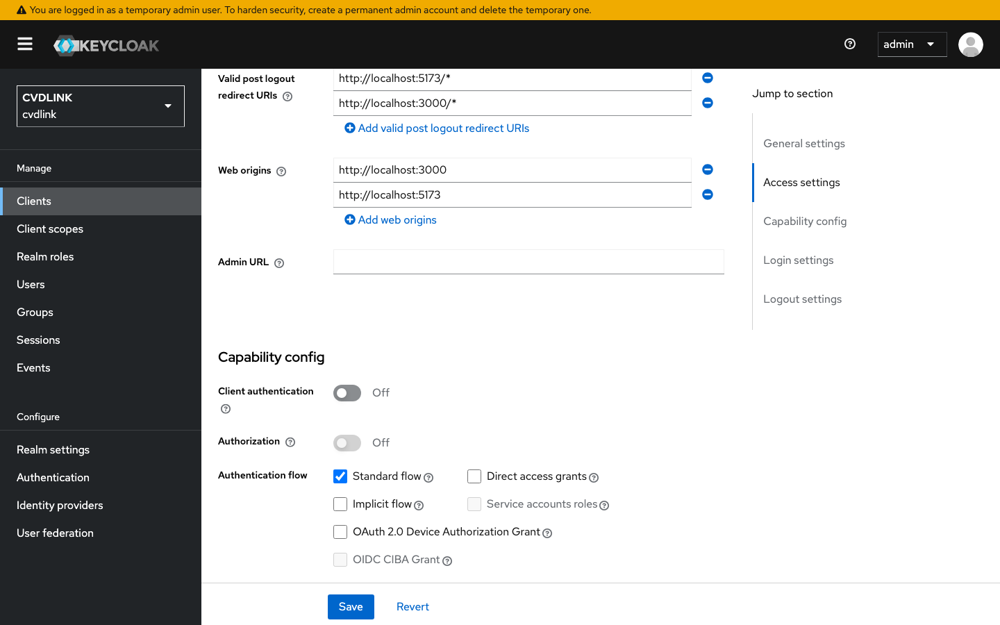
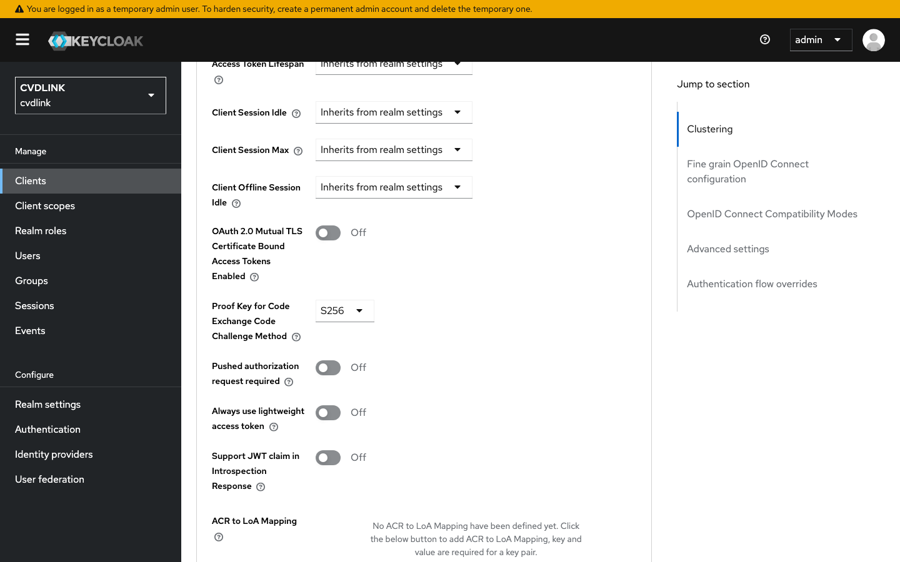
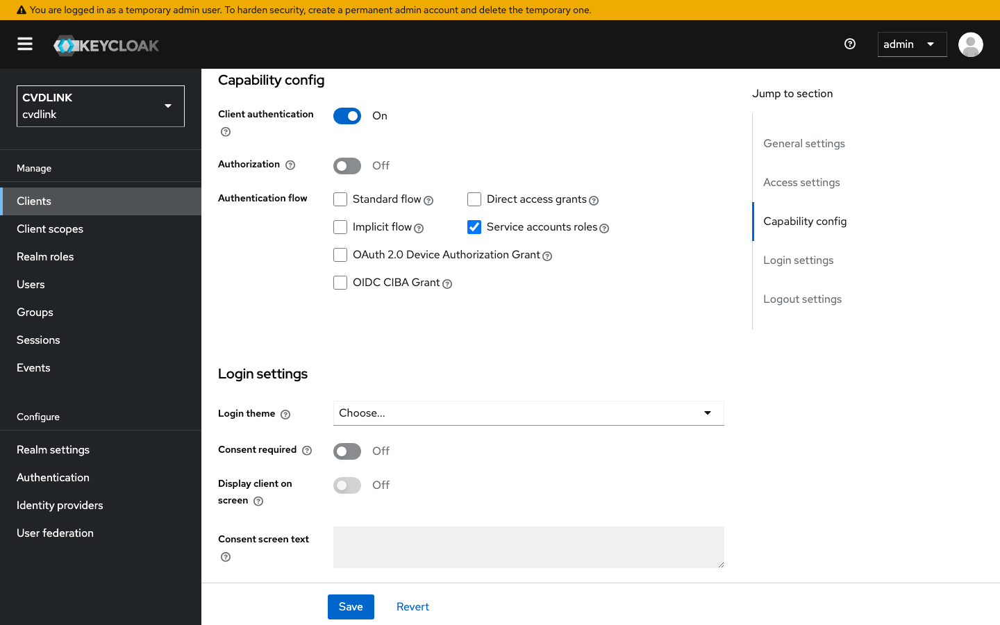
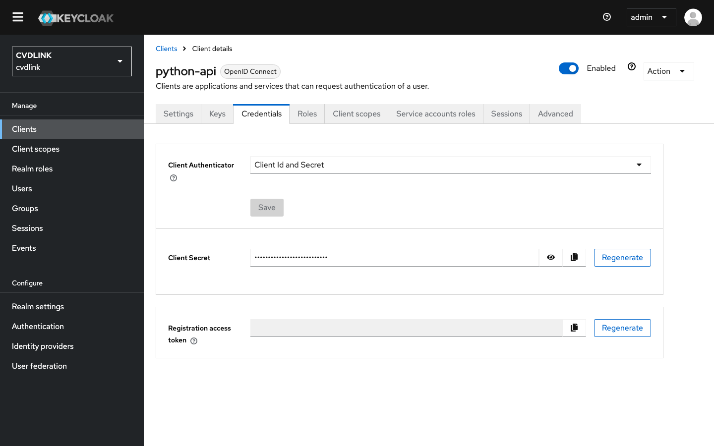
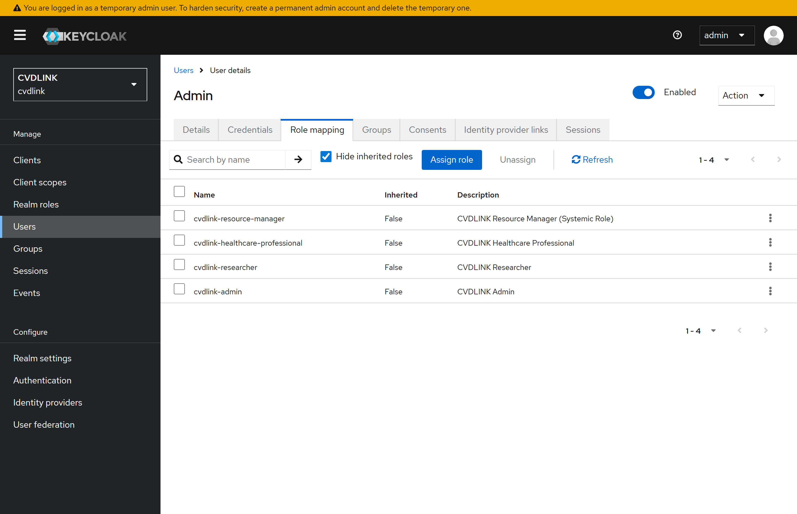

# 2. Realm Setup (Manual)

The repo's `realm-export.json` configures everything below automatically. This page documents the click-by-click equivalent so you understand **what** the import does and can replicate it on a fresh Keycloak install.

> **Skip this page** if you imported the realm and just want to use it. Jump to [`03-oidc-flow.md`](03-oidc-flow.md).

---

## 2.1 Create the realm

1. Top-left realm dropdown → **Create realm**.
2. **Realm name:** `cvdlink`. **Display name:** `CVDLINK`. Leave the rest at defaults.
3. **Create**.



---

## 2.2 Create realm roles

These are the roles your app's authorization will check against. The CVDLINK
realm uses four roles — the **role name** (slug) is what shows up in
`realm_access.roles` inside the JWT, and the **description** is what the admin
console renders next to it.

| Role name (slug)                  | Description                                |
|-----------------------------------|--------------------------------------------|
| `cvdlink-healthcare-professional` | CVDLINK Healthcare Professional            |
| `cvdlink-researcher`              | CVDLINK Researcher                         |
| `cvdlink-resource-manager`        | CVDLINK Resource Manager (Systemic Role)   |
| `cvdlink-admin`                   | CVDLINK Admin                              |

1. Left nav → **Realm roles** → **Create role**.
2. Fill **Role name** with the slug and **Description** with the human-readable name → **Save**.
3. Repeat for the other three roles.



---

## 2.3 Create the public OIDC client (PKCE)

This client represents your browser-based frontend. Public clients **must** use PKCE — they cannot keep a secret safely.

1. **Clients** → **Create client**.
2. **General settings:**
   - Client type: `OpenID Connect`
   - Client ID: `cvdlink-user`
   - **Next**
3. **Capability config:**
   - Client authentication: **OFF** (public client)
   - Authentication flow: ✅ Standard flow only (uncheck the rest)
   - **Next**
4. **Login settings:**
   - Valid redirect URIs: `http://localhost:5173/*`
   - Web origins: `http://localhost:5173`
   - **Save**



5. After save, open the client → **Advanced** tab → **Proof Key for Code Exchange Code Challenge Method** → set to `S256`.



> ⚠️ **Why PKCE?** Without it, an attacker who intercepts the auth code can exchange it for tokens. PKCE binds the auth code to the client instance via a one-time `code_verifier`. Always `S256`, never `plain`.

---

## 2.4 Create the API client (confidential, service account)

This client represents a backend service that needs to obtain its own tokens (e.g., for calling another service or for service-to-service auth).

1. **Clients** → **Create client**.
2. **General settings:**
   - Client ID: `python-api`
   - **Next**
3. **Capability config:**
   - Client authentication: **ON** (confidential)
   - Authentication flow: ✅ Service accounts roles only (uncheck Standard flow + Direct access grants)
   - **Next**
4. **Login settings:** leave blank → **Save**.



5. After save → **Credentials** tab → copy the **Client secret**. You'll paste it into the Python API's `.env`.



---

## 2.5 Create users

1. **Users** → **Add user**.
2. Username: `researcher`, Email: `researcher@example.com`, Email verified: **ON** → **Create**.
3. On the user's page → **Credentials** tab → **Set password** → `researcher123`, Temporary: **OFF** → **Save**.
4. **Role mapping** tab → **Assign role** → filter by realm roles → check `cvdlink-researcher` → **Assign**.
5. Repeat for `admin` (password `admin123`) and assign **all four** CVDLINK roles
   (`cvdlink-healthcare-professional`, `cvdlink-researcher`, `cvdlink-resource-manager`,
   `cvdlink-admin`) — this is the multi-role demo user used by the `/admin` walkthrough.



---

## 2.6 (Optional) Map roles into the access token

Keycloak puts realm roles inside `realm_access.roles` in the token by default. If you want them in a custom claim or at the top level, configure a **Client scope** mapper:

1. **Client scopes** → `roles` → **Mappers** → existing `realm roles` mapper.
2. Toggle **Add to access token** = ON (default), and optionally rename the **Token claim name**.

For most apps, the default `realm_access.roles` is fine — your resource server reads it directly (see Python API example).

---

## 2.7 Sanity check: get a token

With the realm fully configured, request a token via the password grant **for testing only** (we disabled it in the import; enable it temporarily if you want to try this):

```bash
curl -X POST http://localhost:8081/realms/cvdlink/protocol/openid-connect/token \
  -d "grant_type=password" \
  -d "client_id=cvdlink-user" \
  -d "username=researcher" \
  -d "password=researcher123" | jq .
```

Decode the resulting `access_token` at https://jwt.io to inspect claims. The next doc walks through what's inside.

---

## 2.8 Abbreviations

Terms that appear above. Full glossary in
[`04-ldap.md` §4.1](04-ldap.md#41-abbreviations).

| Short | Long                        | Used here for |
|-------|-----------------------------|----------------|
| OIDC  | OpenID Connect              | Client type ("OpenID Connect"). |
| PKCE  | Proof Key for Code Exchange | Required for the public `cvdlink-user` client. |
| JWT   | JSON Web Token              | The access token whose `realm_access.roles` you map. |
| RBAC  | Role-Based Access Control   | The authorization model — realm roles attached to users. |
| URI   | Uniform Resource Identifier | Redirect URIs configured on the client. |
| S256  | SHA-256                     | PKCE code-challenge method (`S256`, not `plain`). |

---

**Next:** [`03-oidc-flow.md`](03-oidc-flow.md) — the actual auth flows (Authorization Code + PKCE, Client Credentials).
