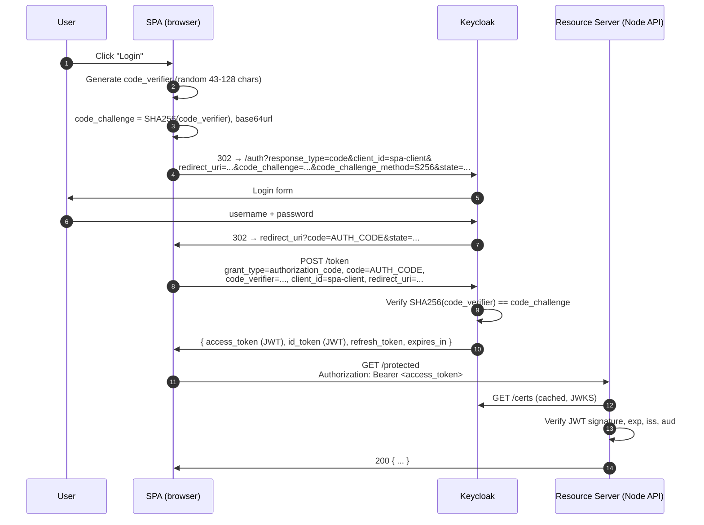
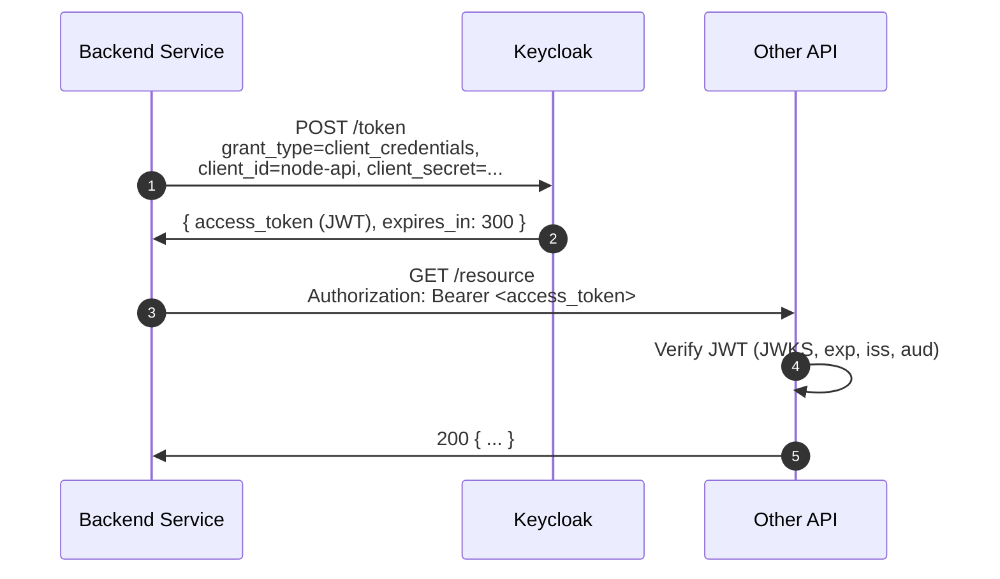
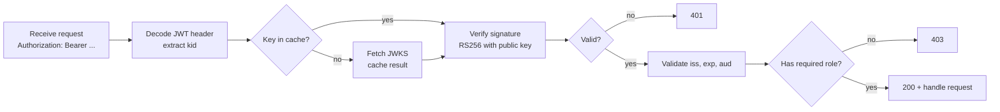

# 3. OIDC Auth Flows

Two flows cover ~90% of real-world Keycloak deployments:

- **Authorization Code + PKCE** — for any user-facing app (SPA, mobile, native, server-rendered web).
- **Client Credentials** — for service-to-service (no user involved).

This page explains both, shows the wire-level requests, and decodes a real JWT.

---

## 3.1 Authorization Code + PKCE



### Why PKCE?

The authorization code is sent through the browser address bar (a redirect). If an attacker grabs it (malicious browser extension, network MITM on a non-HTTPS link, etc.), they could trade it for tokens at the token endpoint.

**PKCE** binds the code to the originating client by requiring the same `code_verifier` that was hashed into `code_challenge` during the auth request. The attacker has the code but not the verifier, so the token exchange fails.

Always use `S256`, never `plain`.

### Endpoints used

```
authorize: http://localhost:8081/realms/playground/protocol/openid-connect/auth
token:     http://localhost:8081/realms/playground/protocol/openid-connect/token
logout:    http://localhost:8081/realms/playground/protocol/openid-connect/logout
```

### Working code

See [`examples/spa`](../examples/spa). It's ~150 lines of vanilla JS — no library — so you can read every step.

---

## 3.2 Client Credentials



No user, no browser, no redirect. The service authenticates with its own credentials.

### Try it

```bash
curl -X POST http://localhost:8081/realms/playground/protocol/openid-connect/token \
  -d "grant_type=client_credentials" \
  -d "client_id=node-api" \
  -d "client_secret=node-api-secret-change-me" | jq .
```

Output:

```json
{
  "access_token": "eyJhbGciOi...",
  "expires_in": 300,
  "token_type": "Bearer",
  "not-before-policy": 0,
  "scope": "email profile"
}
```

### When to use it

- Cron job → API
- Microservice A → Microservice B (where neither acts on behalf of a specific user)
- CI/CD calling deployment APIs

Do **not** use client credentials in a browser app — there is nowhere to safely store the secret.

---

## 3.3 The JWT itself

A Keycloak access token is a signed JWT: `header.payload.signature`, base64url-encoded.

### Header

```json
{
  "alg": "RS256",
  "typ": "JWT",
  "kid": "abc123..."
}
```

`kid` = key ID. The resource server uses it to look up the right public key from the JWKS endpoint.

### Payload (claims)

```json
{
  "exp": 1735689600,
  "iat": 1735689300,
  "jti": "...",
  "iss": "http://localhost:8081/realms/playground",
  "aud": "account",
  "sub": "8a7d...",
  "typ": "Bearer",
  "azp": "spa-client",
  "session_state": "...",
  "realm_access": {
    "roles": ["user", "default-roles-playground", "offline_access"]
  },
  "resource_access": {
    "account": { "roles": ["manage-account", "view-profile"] }
  },
  "scope": "openid email profile",
  "email_verified": true,
  "preferred_username": "demo",
  "email": "demo@example.com"
}
```

| Claim          | What to check                                                          |
|----------------|------------------------------------------------------------------------|
| `iss`          | Must equal your realm's issuer URL.                                    |
| `aud`          | Must include your API's client ID (or be configured per your mapper).  |
| `exp`          | Must be in the future. Reject expired tokens.                          |
| `azp`          | Authorized party — which client requested the token.                   |
| `realm_access.roles` | Realm roles the user/service has. Use for authz.                 |
| `sub`          | Stable user ID. Use this as your foreign key, not `preferred_username`.|

> ⚠️ **`aud` gotcha:** by default Keycloak doesn't add your API's client ID to `aud`. If you want strict audience validation in the resource server, add an **Audience** mapper to the client scope. The Node API example sets `audience: false` to keep things simple — read the comments.

### Signature verification

The resource server fetches **public keys** from `/realms/playground/protocol/openid-connect/certs` (JWKS) and verifies the signature. Keys rotate, so cache with a TTL and refresh on `kid` miss.



---

## 3.4 Refresh tokens

The token response includes a `refresh_token`. When `access_token` expires (default: 5 min), the client exchanges the refresh token for a new pair:

```bash
curl -X POST http://localhost:8081/realms/playground/protocol/openid-connect/token \
  -d "grant_type=refresh_token" \
  -d "client_id=spa-client" \
  -d "refresh_token=$REFRESH_TOKEN"
```

For SPAs, refresh tokens live in memory (or `httpOnly` cookies via a BFF). **Never** put them in `localStorage` if you can avoid it — XSS would exfiltrate them.

For service-to-service (client credentials), don't use refresh tokens at all — just request a new token when you need one. Keycloak doesn't issue refresh tokens for client credentials by default.

---

## 3.5 Logout

Frontend logout = redirect the user to the `end_session_endpoint`:

```
GET http://localhost:8081/realms/playground/protocol/openid-connect/logout
    ?client_id=spa-client
    &id_token_hint=<id_token>
    &post_logout_redirect_uri=http://localhost:5173/
```

This kills the Keycloak SSO session.

**Keycloak 26 requires either `id_token_hint` or `client_id`** on the logout request — passing neither returns `Missing parameters: id_token_hint`. With `id_token_hint` the user is logged out silently; with only `client_id`, Keycloak shows a "do you want to sign out?" confirmation page. The SPA example passes both, so it works in either state.

---

**Next:** [`../examples/spa`](../examples/spa) and [`../examples/node-api`](../examples/node-api) — runnable code that implements everything above.
