# 4. LDAP federation (optional)

This guide adds **OpenLDAP** as an authoritative user directory and federates
it into a new `ldap` realm in Keycloak. The default `docker compose up -d` flow
is unchanged — this section is opt-in via a Docker Compose
[profile](https://docs.docker.com/compose/profiles/).

> **Time:** ~5 minutes (one-shot seed runs in <30s once Keycloak is healthy)
> **Prereqs:** Docker + Docker Compose v2; the base playground already runs.
> **What it does NOT do:** modify the existing `cvdlink` realm, or expose
> LDAPS / TLS (plain `ldap://` only — sandbox-grade).

---

## 4.1 Abbreviations

LDAP is one of the oldest pieces of identity plumbing on the internet, and the
documentation around it is dense with two- and three-letter acronyms. This
section collects every shortened term used in this guide so you do not have to
keep a separate tab open to look them up.

| Short | Long | Meaning in this guide |
|-------|------|-----------------------|
| **LDAP**  | Lightweight Directory Access Protocol | Wire protocol for reading/writing a directory tree. OpenLDAP is the server, `ldap3` is the Python client. |
| **LDAPS** | LDAP over SSL/TLS                     | The same protocol on port 636 with TLS. Not enabled in this playground. |
| **DN**    | Distinguished Name                    | The full path to an entry, read right-to-left, e.g. `uid=rytis,ou=people,dc=cvdlink,dc=local`. Unique within the directory. |
| **RDN**   | Relative Distinguished Name           | The left-most piece of a DN — the name *relative* to the parent. For a user it is usually `uid=rytis`. |
| **DC**    | Domain Component                      | One label of the directory root. `dc=cvdlink,dc=local` mirrors the DNS name `cvdlink.local`. |
| **OU**    | Organizational Unit                   | A subtree inside the directory. We use two: `ou=people` for users and `ou=groups` for groups. |
| **CN**    | Common Name                           | Display name of an entry. For users: full name (`Rytis Augustauskas`); for groups: the group name (`admins`). |
| **SN**    | Surname                               | Family name attribute required by the `inetOrgPerson` schema. |
| **UID**   | User ID                               | Short login name (`rytis`, `vaidotas`, …). Used as the `uid` attribute and as the RDN. |
| **LDIF**  | LDAP Data Interchange Format          | Textual representation of directory entries. [`bootstrap.ldif`](../ldap/bootstrap.ldif) is one example. |
| **IdP**   | Identity Provider                     | The service that *issues* identities and tokens. Keycloak is the IdP here. |
| **SP**    | Service Provider / Resource Server    | An app that *consumes* tokens. The Python API in `examples/python-api` is an SP. |
| **SSO**   | Single Sign-On                        | One login session unlocks several applications. Keycloak provides SSO across all realms it hosts. |
| **OIDC**  | OpenID Connect                        | OAuth 2.0 + identity layer. Keycloak speaks OIDC; LDAP itself does not. |
| **JWT**   | JSON Web Token                        | The signed bearer token Keycloak hands out after a successful login. |
| **JWKS**  | JSON Web Key Set                      | The endpoint that publishes the public keys used to verify JWT signatures. |
| **PKCE**  | Proof Key for Code Exchange           | OAuth 2.0 extension that binds an auth-code to the client that requested it. Public clients (SPA, mobile) must use it. |
| **BFF**   | Backend-for-Frontend                  | Server-side companion to a browser app that holds tokens (httpOnly cookies) so they never reach JavaScript. An alternative to storing tokens in `localStorage`. |
| **SPA**   | Single-Page Application               | Browser app rendered by a JS framework. The CVDLINK Login Sample is one. |
| **IAM**   | Identity and Access Management        | Umbrella term for users, roles, groups, and the policies that connect them. |
| **RBAC**  | Role-Based Access Control             | Permissions are attached to roles, not directly to users. CVDLINK uses RBAC via realm roles. |
| **ACL**   | Access Control List                   | Per-entry permissions list inside LDAP (`olcAccess`). The seed does not modify ACLs. |
| **UUID**  | Universally Unique Identifier         | 128-bit ID. OpenLDAP assigns one as `entryUUID`; Keycloak uses it as the federated user's stable key. |
| **YAML**  | YAML Ain't Markup Language            | Human-readable config format. [`ldap/users.yaml`](../ldap/users.yaml) is the seed input. |
| **API**   | Application Programming Interface     | HTTP interface — Keycloak Admin API, Python API resource server, etc. |
| **TLS**   | Transport Layer Security              | The "S" in HTTPS / LDAPS. |

---

## 4.2 What you get

When the `ldap` Docker Compose profile is active, the stack gains two
containers (in addition to the Keycloak and Postgres containers from the base
playground):

| Service     | Image                          | Host port → container | Role |
|-------------|--------------------------------|------------------------|------|
| `openldap`  | `osixia/openldap:1.5.0`        | **389 → 389**          | Authoritative user store (LDAP server). |
| `ldap-seed` | built from `./ldap/seed`       | (none)                 | One-shot Python bootstrap container. Seeds LDAP from `users.yaml`, then configures Keycloak via its Admin API. |

…and a new realm appears inside the existing Keycloak:

| Realm  | Federation                        | Users (from `ldap/users.yaml`)                          | Groups                                                              |
|--------|-----------------------------------|---------------------------------------------------------|----------------------------------------------------------------------|
| `ldap` | OpenLDAP, `editMode: WRITABLE`    | `rytis`, `vaidotas`, `ana`, `daivaras`, `monika`        | `admins`, `researchers`, `healthcare-professionals`, `resource-managers` |

The original `cvdlink` realm is untouched.

### How the pieces talk to each other

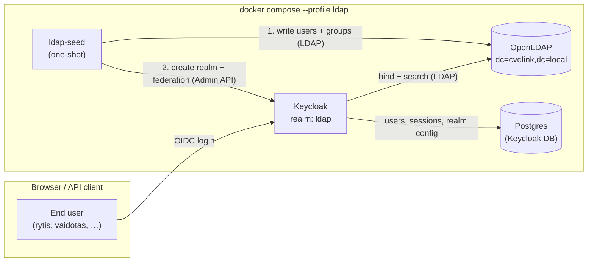

The seed container runs **once**, leaves the directory + Keycloak configured,
and then exits with code 0. Keycloak then talks to OpenLDAP directly on every
subsequent login.

### LDAP directory tree

OpenLDAP stores entries as a tree. The shape this playground seeds looks like:

```text
dc=cvdlink,dc=local
├── ou=people
│   ├── uid=rytis         (CVDLINK Admin + Researcher)
│   ├── uid=vaidotas      (CVDLINK Researcher)
│   ├── uid=ana           (CVDLINK Healthcare Professional)
│   ├── uid=daivaras      (CVDLINK Resource Manager)
│   └── uid=monika        (CVDLINK Healthcare Professional + Researcher)
└── ou=groups
    ├── cn=admins
    ├── cn=researchers
    ├── cn=healthcare-professionals
    └── cn=resource-managers
```

Two **OUs** (Organizational Units) under the root: one for people, one for
groups. Each group is a `groupOfNames` whose `member` attribute holds the full
**DNs** (Distinguished Names) of its users. This is the standard "static group"
pattern in LDAP.

### Login sequence

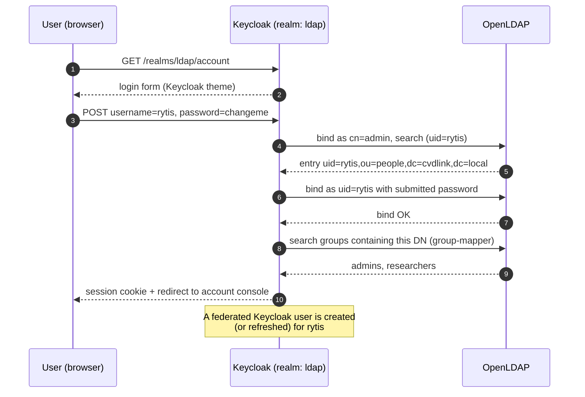

Steps **3–5** are why OpenLDAP needs to be reachable on every login — Keycloak
does the credential check against LDAP, not against its own Postgres user
table. Step **6** is how Keycloak knows what groups `rytis` belongs to (the
group-mapper component the seed installs).

---

## 4.3 Start it

```bash
docker compose --profile ldap up -d --build
```

This brings up `openldap` and runs `ldap-seed` once. The seed container:

1. Upserts users + groups into OpenLDAP from [`ldap/users.yaml`](../ldap/users.yaml).
2. Creates the `ldap` realm in Keycloak if it does not already exist.
3. Registers OpenLDAP as a Keycloak `UserStorageProvider` on that realm.
4. Adds a group-mapper so `groupOfNames` membership is visible in Keycloak.

Tail the seed log to confirm:

```bash
docker compose logs ldap-seed
```

Expected last line: `INFO done`.

> ℹ️ The `osixia/openldap` image is slow to initialise on first start (can
> take 60–120s on a cold build). The seed container retries the LDAP
> connection for up to 3 minutes. If `ldap-seed` still exits non-zero, the
> LDAP container was not ready yet — just re-run the seed manually (it is
> idempotent):
> `docker compose --profile ldap run --rm ldap-seed`.

---

## 4.4 Verify

### 4.4.1 In the admin console

1. Open <http://localhost:8081/admin> (`admin` / `admin`).
2. Switch the realm dropdown (top-left) to `ldap`.
3. **Users** → all five seeded users (`rytis`, `vaidotas`, `ana`, `daivaras`,
   `monika`) appear in the list.
4. **User federation** → the `ldap` `UserStorageProvider` is listed and
   *Enabled*.
5. **Groups** → `admins`, `researchers`, `healthcare-professionals`,
   `resource-managers` are all listed (you may need to trigger a *Sync LDAP
   Groups to Keycloak* from the group-mapper if you have not logged in any
   user yet — see [§4.4.4](#444-force-an-immediate-group-sync)).

#### Realm selector

The realm dropdown in the top-left switches between the master realm and the
new `ldap` realm:

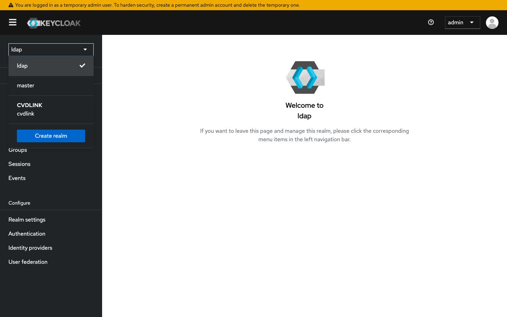

#### Federation provider

The `UserStorageProvider` registered by the seed appears under **User
federation**:

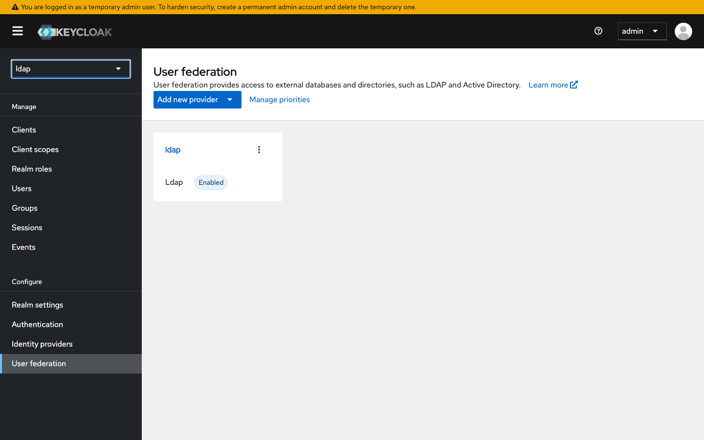

Clicking into it reveals the connection settings (URL, bind DN, base DN,
`editMode: WRITABLE`):

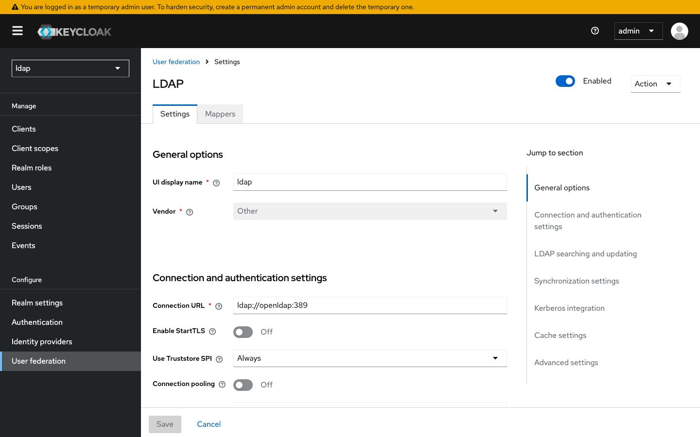

The **Mappers** tab shows the attribute mappers Keycloak's LDAP component
created automatically (`username`, `email`, `first name`, `last name`, …) plus
the `group-mapper` of type `group-ldap-mapper` that the seed added:

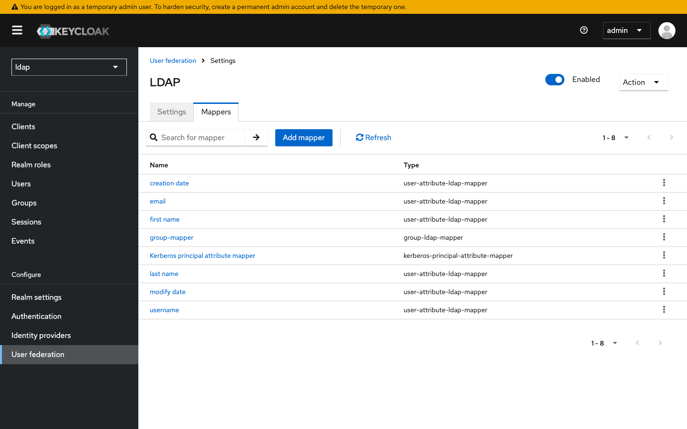

#### LDAP-backed users

All five users from `users.yaml` show up in the `ldap` realm's user list:

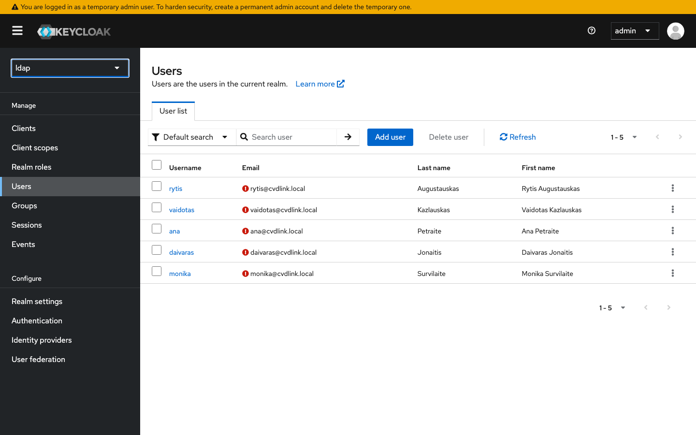

#### Per-user detail

The `rytis` user detail page shows **Federation link: ldap** — Keycloak's
modern equivalent of the gray "LDAP" badge from older admin UIs. The username,
email, first and last name are all sourced from the LDAP entry by the
attribute mappers:

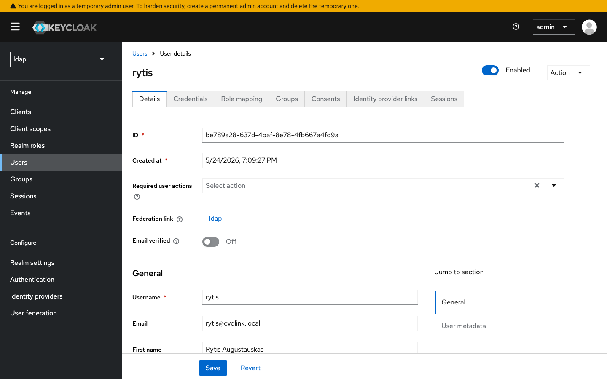

#### Group view

Groups are mirrored from `groupOfNames` entries by the group-mapper. After a
sync, all four LDAP groups appear in the realm:

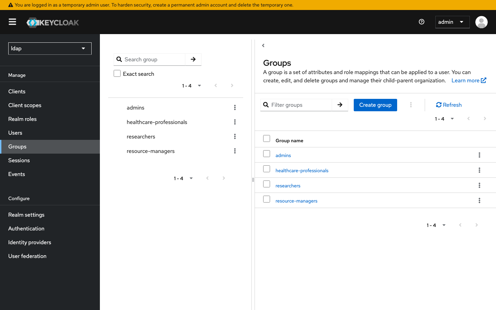

#### Group membership

The interesting case is `monika`, who belongs to *two* groups in LDAP
(`healthcare-professionals` and `researchers`). Multi-group membership flows
through the mapper unchanged:

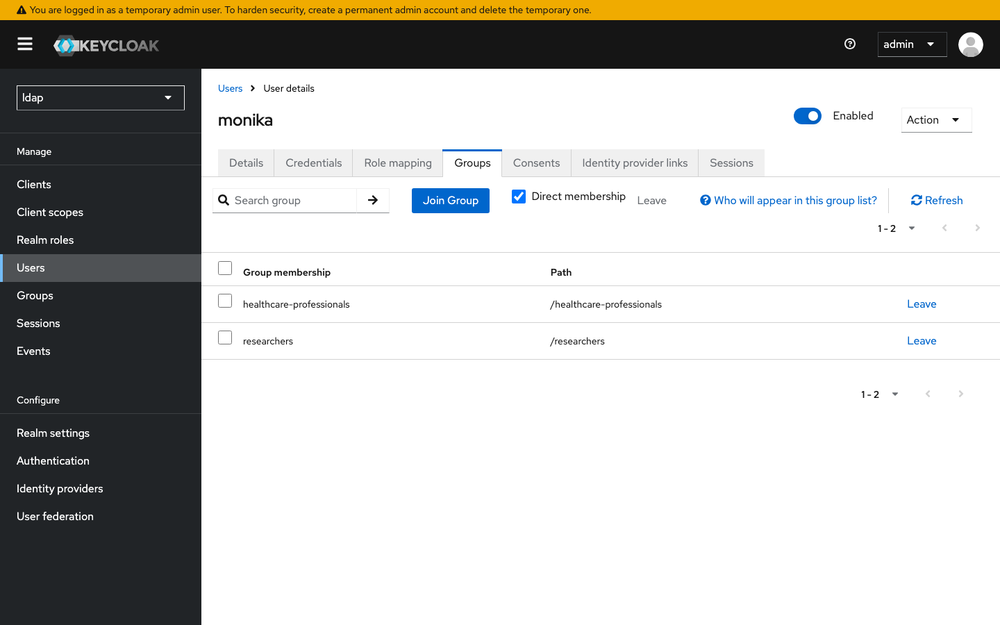

### 4.4.4 Force an immediate group sync

The group-mapper loads groups lazily — a group only appears in the **Groups**
list after at least one of its members has been touched by Keycloak. To
populate everything up-front, trigger a one-shot sync from the admin REST API:

```bash
TOKEN=$(curl -s -X POST http://localhost:8081/realms/master/protocol/openid-connect/token \
  -d "client_id=admin-cli" -d "username=admin" -d "password=admin" \
  -d "grant_type=password" | jq -r .access_token)

FED_ID=$(curl -s -H "Authorization: Bearer $TOKEN" \
  "http://localhost:8081/admin/realms/ldap/components?type=org.keycloak.storage.UserStorageProvider" \
  | jq -r '.[0].id')

MAPPER_ID=$(curl -s -H "Authorization: Bearer $TOKEN" \
  "http://localhost:8081/admin/realms/ldap/components?parent=$FED_ID" \
  | jq -r '.[] | select(.name=="group-mapper") | .id')

curl -s -X POST -H "Authorization: Bearer $TOKEN" \
  "http://localhost:8081/admin/realms/ldap/user-storage/$FED_ID/mappers/$MAPPER_ID/sync?direction=fedToKeycloak"
```

The same action lives in the UI: **User federation → ldap → Mappers →
group-mapper → Sync LDAP Groups to Keycloak**.

### 4.4.2 From the command line

List every person directly from OpenLDAP:

```bash
docker compose exec openldap ldapsearch -x -LLL \
  -D "cn=admin,dc=cvdlink,dc=local" -w admin \
  -b "ou=people,dc=cvdlink,dc=local" "(objectClass=inetOrgPerson)" uid mail
```

Expected output:

```ldif
dn: uid=rytis,ou=people,dc=cvdlink,dc=local
uid: rytis
mail: rytis@cvdlink.local

dn: uid=vaidotas,ou=people,dc=cvdlink,dc=local
uid: vaidotas
mail: vaidotas@cvdlink.local

dn: uid=ana,ou=people,dc=cvdlink,dc=local
uid: ana
mail: ana@cvdlink.local

dn: uid=daivaras,ou=people,dc=cvdlink,dc=local
uid: daivaras
mail: daivaras@cvdlink.local

dn: uid=monika,ou=people,dc=cvdlink,dc=local
uid: monika
mail: monika@cvdlink.local
```

Fetch a single user through Keycloak's Admin API instead — the entry comes
back with `"origin": "ldap"`, proving the federation, not the Postgres table,
served the request:

```bash
TOKEN=$(curl -s -X POST http://localhost:8081/realms/master/protocol/openid-connect/token \
  -d "client_id=admin-cli" -d "username=admin" -d "password=admin" \
  -d "grant_type=password" | jq -r .access_token)

curl -s -H "Authorization: Bearer $TOKEN" \
  "http://localhost:8081/admin/realms/ldap/users?username=rytis" | jq
```

### 4.4.3 As an end user

Log into the user-facing account console:

```
http://localhost:8081/realms/ldap/account
```

Credentials: `rytis` / `changeme` (any user from
[`ldap/users.yaml`](../ldap/users.yaml) works — see the table in [§4.6](#46-user--role-map)).

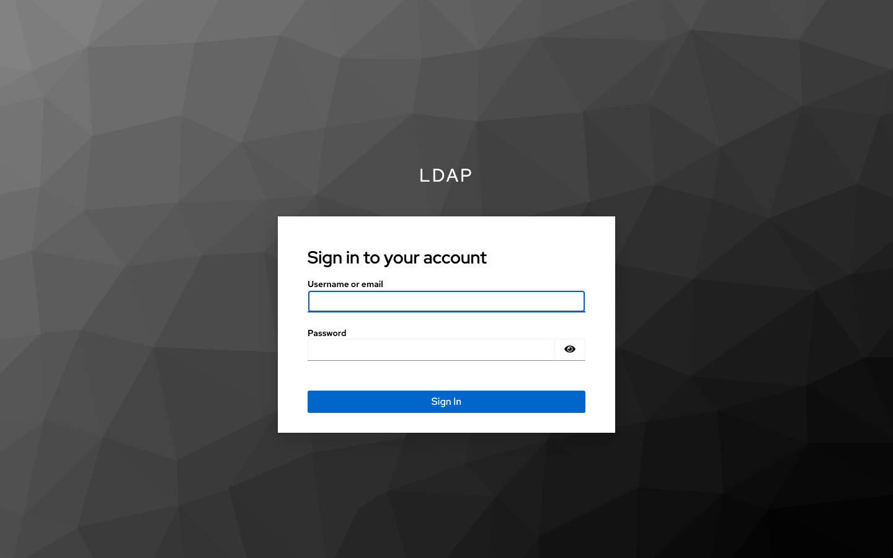

After successful authentication the user lands on the account console, which
shows the attributes mapped from LDAP (full name from `cn`, email from `mail`):

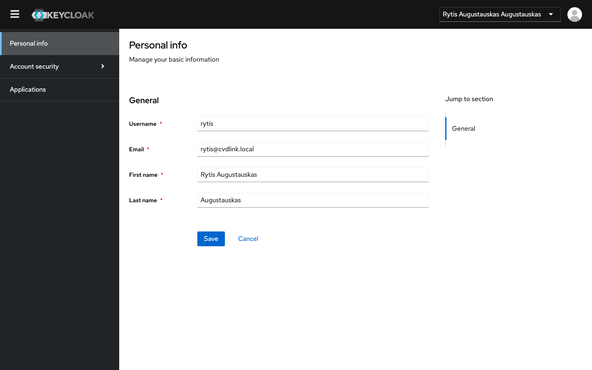

---

## 4.5 Re-seed

The seed is **idempotent** — safe to re-run any time after editing
`ldap/users.yaml`:

```bash
docker compose --profile ldap run --rm ldap-seed
```

Existing users are updated in place (the `modify` branch in
[`ldap/seed/seed/ldap_ops.py`](../ldap/seed/seed/ldap_ops.py)); existing groups
are left alone, and new users are added to whichever groups the YAML names.

---

## 4.6 User → role map

The seeded directory mirrors the CVDLINK domain model — each LDAP group lines
up with one of the realm roles you saw in [§Default credentials](../README.md#default-credentials).

| Username   | Full name             | LDAP groups                                | Maps to CVDLINK role(s)                                    |
|------------|-----------------------|--------------------------------------------|-------------------------------------------------------------|
| `rytis`    | Rytis Augustauskas    | `admins`, `researchers`                    | CVDLINK Admin + CVDLINK Researcher                          |
| `vaidotas` | Vaidotas Kazlauskas   | `researchers`                              | CVDLINK Researcher                                          |
| `ana`      | Ana Petraite          | `healthcare-professionals`                 | CVDLINK Healthcare Professional                             |
| `daivaras` | Daivaras Jonaitis     | `resource-managers`                        | CVDLINK Resource Manager                                    |
| `monika`   | Monika Survilaite     | `healthcare-professionals`, `researchers`  | CVDLINK Healthcare Professional + CVDLINK Researcher        |

All five users share the password `changeme` for local play. The mapping from
LDAP group → realm role is **not automatic** — Keycloak's group-mapper makes
the LDAP groups visible as Keycloak groups, but turning a group into a role
requires either:

- **Group → role mapping** on the Keycloak group (UI: *Groups → admins → Role
  mappings*), or
- A second LDAP mapper of type *role-ldap-mapper* (not configured by this
  playground).

For the current `cvdlink` realm we keep roles attached directly to users; the
`ldap` realm groups are exposed but not yet promoted to realm roles.

---

## 4.7 Run the tests

```bash
docker compose --profile ldap run --rm ldap-seed pytest -v
```

Covers:

- **`test_config.py`** — YAML parsing into typed `User`/`Group` dataclasses.
- **`test_ldap_ops.py`** — LDAP upsert idempotency, password bind, group
  membership, and the `modify`-branch update path.
- **`test_directory.py`** — end-to-end visibility in OpenLDAP and in the
  federated Keycloak realm (incl. multi-group membership via `monika`).

---

## 4.8 Add a user

### Declarative (recommended — reproducible)

Edit [`ldap/users.yaml`](../ldap/users.yaml):

```yaml
users:
  - uid: laura
    cn: Laura Kavaliauskaite
    sn: Kavaliauskaite
    mail: laura@cvdlink.local
    password: changeme
    groups: [researchers]
```

Then:

```bash
docker compose --profile ldap run --rm ldap-seed
```

### Via the Keycloak admin UI

Realm `ldap` → **Users** → *Add user*. Federation is `WRITABLE`, so the new
user is written **through** to OpenLDAP (not just stored in Keycloak's local
table).

### Via raw LDAP

```bash
docker compose exec openldap ldapadd -x \
  -D "cn=admin,dc=cvdlink,dc=local" -w admin <<'EOF'
dn: uid=laura,ou=people,dc=cvdlink,dc=local
objectClass: inetOrgPerson
uid: laura
cn: Laura Kavaliauskaite
sn: Kavaliauskaite
mail: laura@cvdlink.local
userPassword: changeme
EOF
```

---

## 4.9 Tear it down

```bash
# stop only LDAP, keep base playground running
docker compose --profile ldap down

# stop everything but keep data
docker compose down

# nuke everything (postgres + openldap volumes)
docker compose down -v
```

---

**Next:** Try a login flow against the `ldap` realm — point the
[`examples/cvdlink-login-sample`](../examples/cvdlink-login-sample/) at
`http://localhost:8081/realms/ldap` (after creating a client there). If you
plan to put a browser SPA in front of an LDAP-backed realm, consider the
**BFF** (Backend-for-Frontend) pattern from [§3.4](03-oidc-flow.md#34-refresh-tokens)
so refresh tokens stay in httpOnly cookies and never touch JavaScript.
